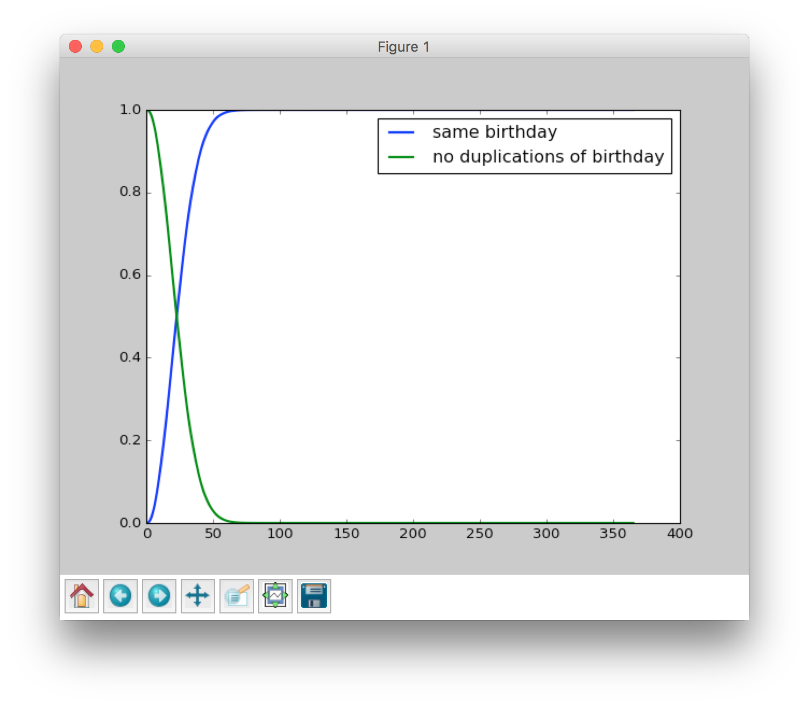

# Birthday Permutation

#### *How many people do we need to have in a room to make it a favorable bet (probability of success greater than 1/2) that two people in the room will have the same birthday?*

This is an example I read it from the book, *"Introduction to Probability"*. The solution is:

Assume that there are 365 possible birthdays for each person(ignore leap years). We must find the probability that have no duplication of birthdays.

For two people, it is...

$$
\frac{365 \times 364}{365^2}
$$

For three people, it is...

$$
\frac{365 \times 364 \times 363}{365^3}
$$

For more people, it is...

$$
\frac{365 \times 364 \times \dotsm \times (365 - i + 1)}{365^i} \text{, where $i$ = 2, 3, ..., 365}
$$

So the probability that two people in the room will have the same birthday is...

$$
1 - \frac{365 \times 364 \times \dotsm \times (365 - i + 1)}{365^i} \text{, where $i$ = 2, 3, ..., 365}
$$

It turns out that

```txt
Number of people, Probability that two ppl have same birthday
20                0.411438
21                0.443688
22                0.475695
23                0.507297 <-- the answer
24                0.538344
25                0.568700
```

There you go the solution. And it's such a practical problem that could happen in any party!

Let's Code
----------

The Python code is:

```python
def calc_prob(ppl_num):
    """
    Calc the probability of that ppl have no duplication of birthdays.
    """
    prob_no_dup = 1
    if ppl_num > 1:
        for i in range(1, ppl_num):
            prob_no_dup *= (365. - i if i <= 365 else 0) / 365.
    return 1. - prob_no_dup
```

Let's Plot
----------

It is tempting to guess that we would need about $$\frac{1}{2}$$ this number, or $$183$$, but the answer is $$23$$. From the chart we can see the probability that two people have same birthday is almost $$1$$ when there're more than $$100$$ people in a room.



